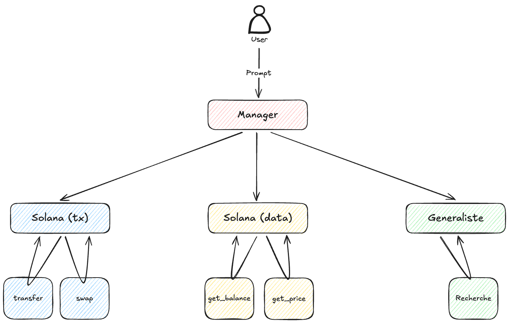

# Agent Kit LangGraph

Cet exemple montre comment construire un agent Solana avancé en utilisant LangGraph et le Solana Agent Kit. Il présente un système multi-agents capable de gérer diverses tâches liées à Solana à travers un flux de travail dirigé.



## Fonctionnalités

- Architecture multi-agents utilisant StateGraph de LangGraph
- Agents spécialisés pour différentes tâches :
  - Agent généraliste pour les requêtes basiques (avec intégration optionnelle de Tavily search)
  - Agent de transfert/échange pour les opérations de transaction
  - Agent de lecture pour les requêtes de données blockchain
  - Agent gestionnaire pour le routage et l'orchestration
- Configuration basée sur l'environnement
- Implémentation en TypeScript avec sécurité de typage complète

## Prérequis

- Node.js (v16 ou supérieur)
- Gestionnaire de paquets pnpm
- Environnement de développement Solana

## Installation

1. Clonez le dépôt et naviguez vers le répertoire d'exemple :

```bash
cd examples/agent-kit-langgraph
```

2. Installez les dépendances :

```bash
pnpm install
```

3. Configurez les variables d'environnement :

```bash
cp .env.example .env
```

Modifiez le fichier `.env` avec votre configuration :

- Ajoutez votre clé API OpenAI
- Ajoutez votre clé API Tavily (optionnel, active les capacités de recherche web)
- Configurez toutes les autres variables d'environnement requises

## Structure du Projet

```
src/
├── agents/         # Implémentations des agents individuels
├── helper/         # Utilitaires d'aide et exemples
├── prompts/        # Prompts et templates des agents
├── tools/          # Outils personnalisés pour les agents
└── utils/          # Fonctions utilitaires et configurations
```

## Utilisation

Pour exécuter l'exemple :

```bash
pnpm dev src/index.ts
```

L'exemple démontre un flux de travail où :

1. L'agent gestionnaire reçoit la requête initiale
2. En fonction du type de requête, il la dirige vers l'agent spécialisé approprié :
   - Requêtes générales → Agent Généraliste
   - Opérations de transfert/échange → Agent TransferSwap
   - Requêtes de données blockchain → Agent de Lecture

## Dépendances

- `@langchain/community` : Outils et utilitaires de la communauté LangChain
  - Inclut l'intégration de Tavily search pour des réponses améliorées aux requêtes
- `@langchain/core` : Fonctionnalités principales de LangChain
- `@langchain/langgraph` : Flux de travail d'agents basés sur les graphes
- `solana-agent-kit` : Kit d'Agent Solana pour les interactions blockchain
- `zod` : Vérification des types à l'exécution

## Sources

- [LangGraph](https://langchain.com/langgraph)
- [Solana Agent Kit](https://github.com/dialect-to/solana-agent-kit)
- [Tavily](https://www.tavily.com/)

## Contribution

Les contributions sont les bienvenues ! N'hésitez pas à soumettre une Pull Request.

## Licence

Licence ISC
