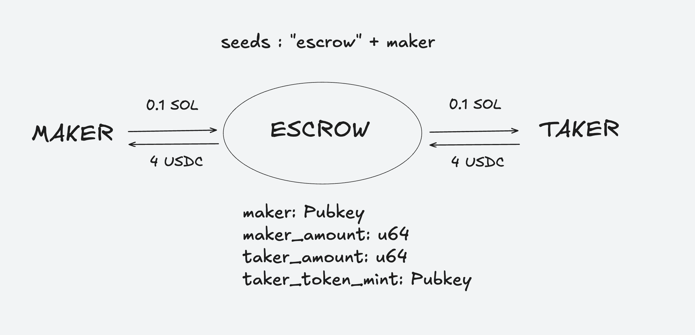

# Escrow-SOL-Token

## 📌 Introduction

Escrow-SOL-Token est un smart contract Solana permettant de sécuriser une transaction entre deux utilisateurs.  
L'utilisateur **A** dépose des SOL dans l'escrow en indiquant le montant et l'addresse du token qu'il souhaite en échange.
L'utilisateur **B** peut ensuite récupérer les SOL en échange des tokens.

## 📜 Conception

  

## 🛠 Installation et Configuration

```sh
anchor init escrow-sol-token
```
```sh
anchor build
```
```sh
anchor deploy
```

### 4️⃣ Lancement des tests
```sh
anchor test --skip-deploy --skip-local-validator
```

## 🚀 Exécution locale

### Démarrer un validateur local Solana
```sh
solana-test-validator
```

### Configuration de Solana en local
Afficher la configuration actuelle :
```sh
solana config get
```
Définir l'URL locale :
```sh
solana config set --url localhost
```
